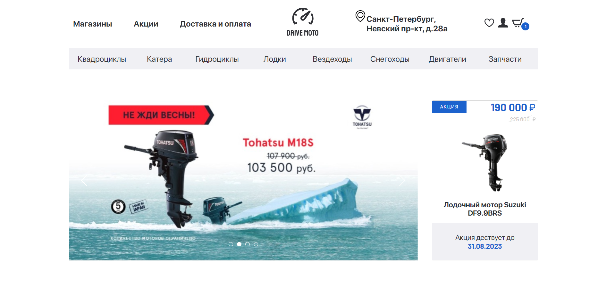
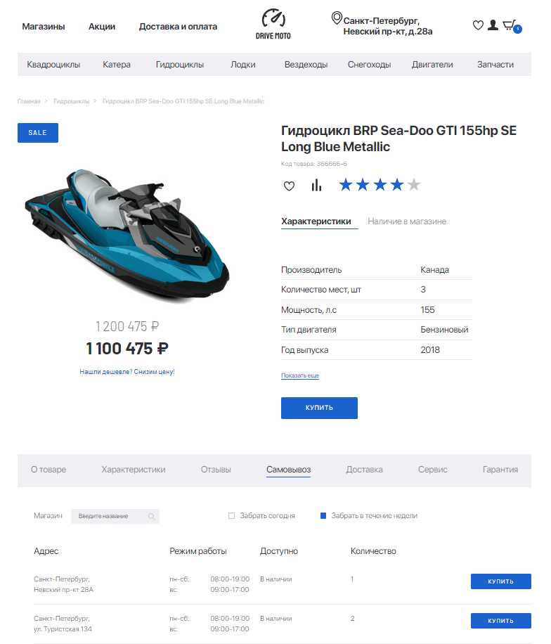
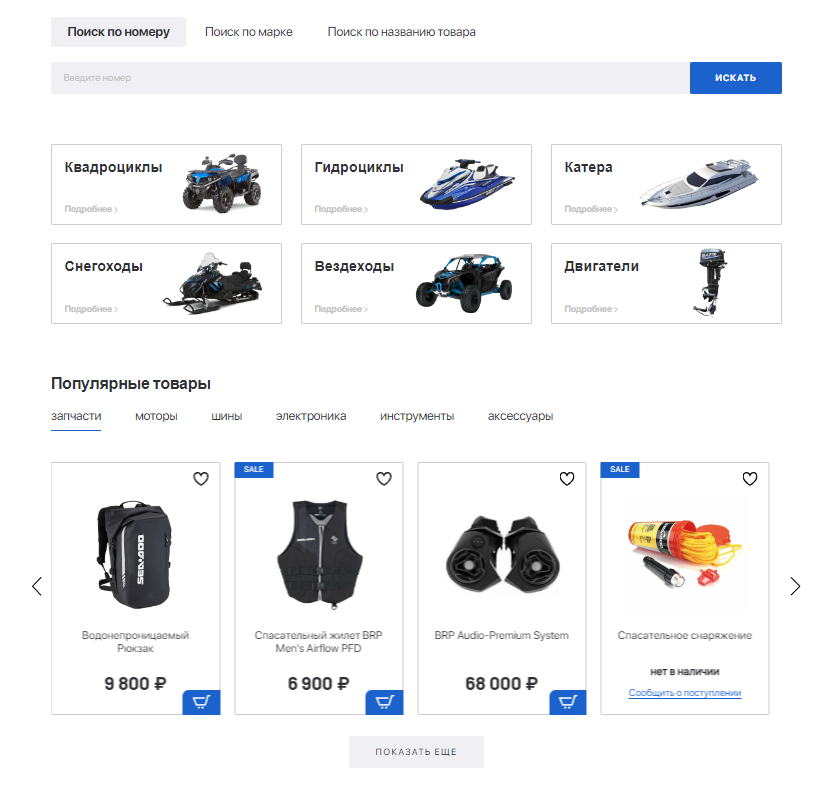
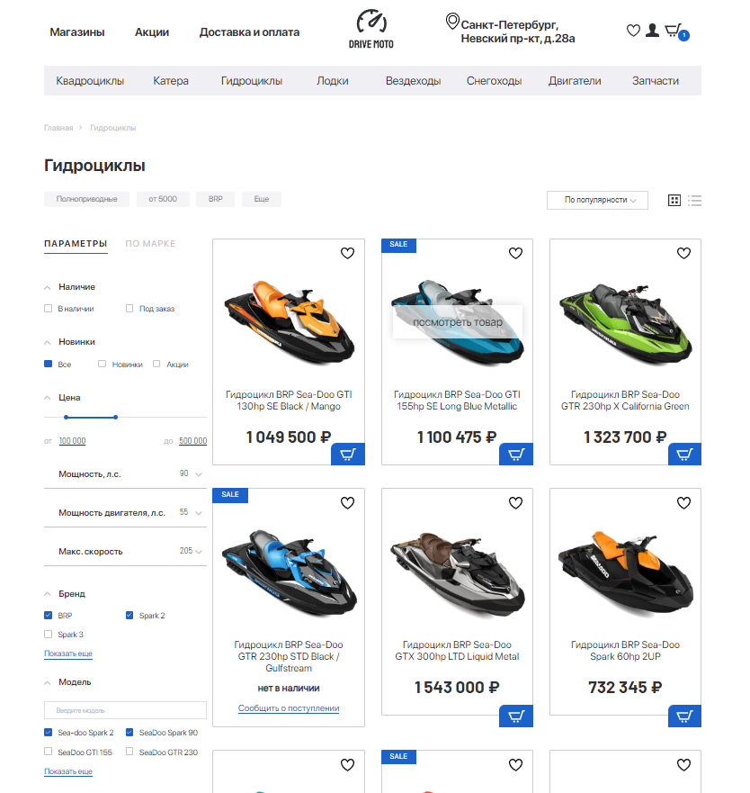
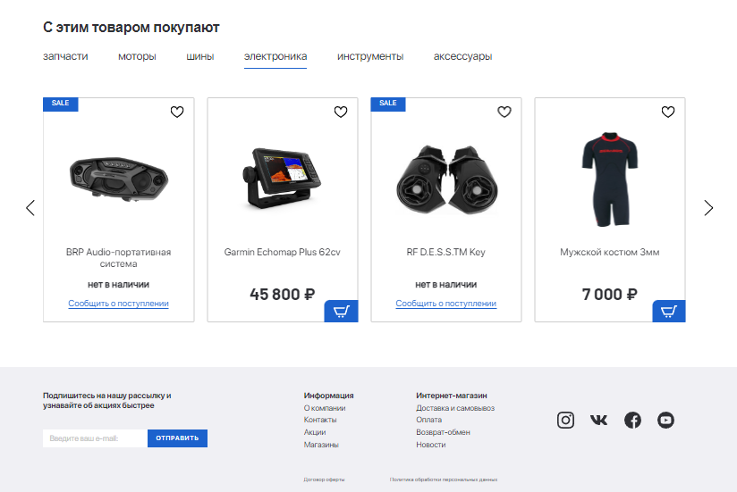

<h1 align="center"> JetSkisOnlineStore</h1>

Вёрстка по макету: главная страница, список товаров и фильтры, карточка товара.

 

<h2 align="left">Описание проекта</h2>

Взглянуть на проект можно [по сылке](https://zaprostoneprosto.github.io/JetSkisOnlineStore/). 

Проект **JetSkisOnlineStore** подготовлен для отработки навыков верстки статичных интернет страниц.

Первоначальная концепция проекта предполагала верстку по **Pixel perfect**, однако в процессе работы обнаружились многочисленные *особенности* макета. В связи с чем в некоторых местах добавлена творческая составляющая. Проект **адаптирован** под разрешение экранов как мобильных, так и настольных устройств.

<h2 align="left">Скриншоты</h2>

Нажмите, чтобы развернуть

  

    
1. Карточка товара

    

      
    

  

  

    
2. Категории товаров

    

      
    

  

  

    
3. Список товаров и фильтры

    

      
    

  

  

    
4. Блок рекомендаций

    

      
    

  

<h2 align="left">Структура</h2>

Проект состоит из трёх связанных между собой страниц:
- Главная страница ([ссылка](https://zaprostoneprosto.github.io/JetSkisOnlineStore/index.html))
- Страница с товарами и фильтрами - Гидроциклы ([ссылка](https://zaprostoneprosto.github.io/JetSkisOnlineStore/catalog.html))
- Страница товара - Гидроикл BRP Sea-Doo GTI 155hp SE Long Blue Metallic ([ссылка](https://zaprostoneprosto.github.io/JetSkisOnlineStore/product-page.html))

<h2 align="left">Использованные технологии</h2>

Проект стилизован с помощью **CSS**:
- Для расположения элементов на странице использовались свойства display со значением **flex** и **grid**.
- Для стилизации элементов использовались **псевдоклассы**.

Для создания каруселей и рейтинга товаров применены JS библиотеки.

<h2 align="left">Планы по доработке проекта</h2>

В будущем планируется ~~добавить~~:

- Обращать внимание на нюансы проекта ДО начала работы над ним.
